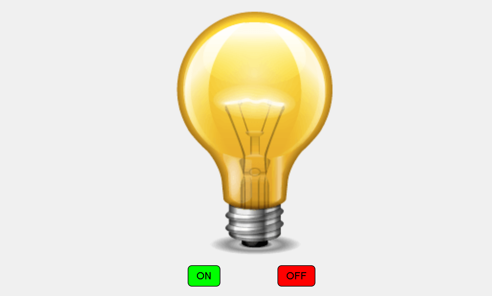

# Bulb Toggle (ON/OFF) Project

This project demonstrates a simple interactive "bulb on/off" effect using HTML, CSS, and JavaScript. The interface includes two buttons to switch the bulb's image between "on" and "off" states, making it a great beginner project to practice JavaScript DOM manipulation and responsive design.

## Project Features
- **Interactive Functionality:** Click "ON" to turn the bulb on and "OFF" to turn it off.
- **Responsive Design:** Scales and adjusts for all screen sizes, including mobile and tablet.
- **Clean and Simple UI:** Designed with minimal styling to highlight functionality.

## Technologies Used
- **HTML**: For structuring the web page.
- **CSS**: For styling and responsive design adjustments.
- **JavaScript**: For functionality to switch the bulb image.

## Preview
 *(Replace with a screenshot showing the bulb on and off)*

## How to Use
1. Clone the repository:
   git clone https://github.com/itsalokbarnwal/bulb-toggle-js.git
